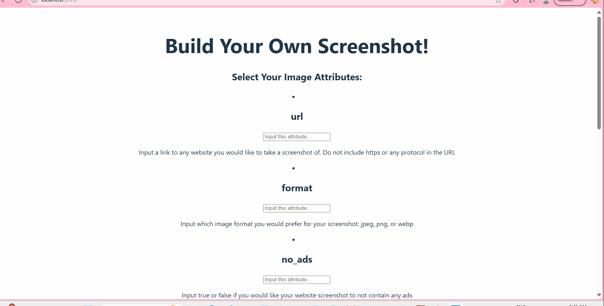

# 📸 **Screenshot Generator**

A simple React app that generates high-quality screenshots of websites using the ApiFlash API. Users can input a URL, customize parameters like format, resolution, and ads/cookie banner removal, then view and collect their screenshots in a gallery.

## 🚀 **Features**
- Submit a URL and get an instant screenshot

- Customize query parameters (format, width, height, etc.)

- View a gallery of all screenshots taken

## 🛠 **Technologies Used**
- React (Vite)

- JavaScript (ES6+)

- ApiFlash API

- CSS

## **Video Walkthrough**

GIF created with ScreenToGif

## 📦 **Setup**
- Clone the repo

- Run npm install

- Add your ApiFlash key to .env as VITE_APP_ACCESS_KEY

- Run npm run dev to start

